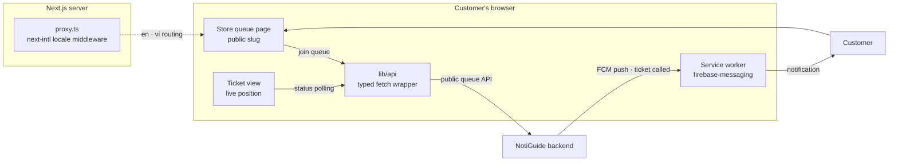

# NotiGuide — Client App

The customer's side of NotiGuide. Open a store's link, take a number, and put your phone back in your pocket — your place in line is tracked live, and when staff call you, a push notification finds you. No account, no app install, no standing around staring at a counter display.

It's a deliberately small Next.js app: mobile-first, bilingual (English/Vietnamese), with Firebase Cloud Messaging wired through a service worker so notifications arrive even with the tab in the background.

## Techstack

<p>
  <a href="https://nextjs.org/"></a>
  <a href="https://react.dev/"></a>
  <a href="https://www.typescriptlang.org/"></a>
  <a href="https://tailwindcss.com/"></a>
  <a href="https://ui.shadcn.com/"></a>
  <a href="https://firebase.google.com/"></a>
  <a href="https://biomejs.dev/"></a>
  <a href="https://vitest.dev/"></a>
  <a href="https://yarnpkg.com/"></a>
</p>

## The NotiGuide System

NotiGuide is an end-to-end queue management and notification system for stores — customers join a virtual queue from their phone, staff run the floor from a dashboard, and calls reach people through web push or dedicated RF pagers. This repository is the app the customer holds.

| Repository | Role |
|------------|------|
| [notiguide](https://github.com/Thomas-Hoang-04/notiguide) | Workspace superproject — system docs and submodule index |
| [notiguide-be](https://github.com/Thomas-Hoang-04/notiguide-be) | Reactive Kotlin/Spring Boot API — queue engine, auth, analytics, device orchestration |
| [notiguide-admin](https://github.com/Thomas-Hoang-04/notiguide-admin) | Next.js dashboard for store staff — live queue control, dispatch, analytics |
| **notiguide-client** (this repo) | Next.js customer app — join queues, track position, receive web push |
| [notiguide-transmitter](https://github.com/Thomas-Hoang-04/notiguide-transmitter) | ESP32-C3 hub bridging MQTT dispatches to RF pager calls |
| [notiguide-receiver (`esp32`)](https://github.com/Thomas-Hoang-04/notiguide-receiver/tree/esp32) | ESP32-C3 pager — dual-radio (2.4 GHz nRF24 or 433 MHz OOK) |
| [notiguide-receiver (`esp8266`)](https://github.com/Thomas-Hoang-04/notiguide-receiver/tree/esp8266) | ESP8266 pager on the 433 MHz link |

## Features

- **Join by link** — every store exposes a public slug; opening it shows the queue and a join form, no sign-up involved.
- **Live ticket tracking** — position and status refresh automatically while you wait.
- **Web push when called** — opt in once and the call notification arrives via FCM, even with the browser tab in the background.
- **Bilingual & themed** — English and Vietnamese, light and dark, mobile-first layout.

## Technical Highlights

- **FCM through a service worker** — push tokens registered with the backend per ticket, notifications delivered by `firebase-messaging` in the background.
- **Next.js 16 + React 19 with the React Compiler** — the UI stays simple and the compiler keeps it fast.
- **Resilient API layer** — a typed `fetch` wrapper with request timeouts and structured error types (rate-limit, not-found, network) pointed at the backend's public queue API, polling at an adaptive interval.
- **Vietnamese written natively** — the `vi.json` catalog reads like a Vietnamese speaker wrote it, because one did; structure mirrors `en.json`, phrasing doesn't.

## Architecture



## Screenshots

> 📷 *Store queue page with join form — coming soon*
<!-- PHOTO: public store page on mobile, queue status + join button -->

> 📷 *Live ticket view with position — coming soon*
<!-- PHOTO: ticket tracking screen showing position in line -->

> 📷 *Call notification arriving — coming soon*
<!-- PHOTO: browser push notification for a called ticket -->

## Getting Started

You need a recent Node.js LTS with Corepack (the repo pins Yarn 4) and a running [NotiGuide backend](https://github.com/Thomas-Hoang-04/notiguide-be). Configuration lives in `.env.local`: the backend URL (`NEXT_PUBLIC_API_BASE_URL`) plus the Firebase keys for web push.

```bash
yarn install
yarn dev          # http://localhost:3000
yarn build        # production build
yarn lint         # biome check
yarn test         # vitest run
```

## Project Structure

```
src/
├── app/          — App Router routes (store pages, ticket views)
├── features/     — domain logic: queue (join · live tracking), store (public store data)
├── components/   — shared shadcn/ui components
├── store/        — zustand stores
├── hooks/ lib/   — shared hooks and utilities
├── i18n/ messages/ — next-intl setup + en/vi catalogs
├── styles/       — global and per-feature CSS
├── types/        — shared TypeScript types
└── proxy.ts      — Next.js middleware (next-intl locale routing)
```

---

_**Created by Minh Hai Hoang. June 2026**_
